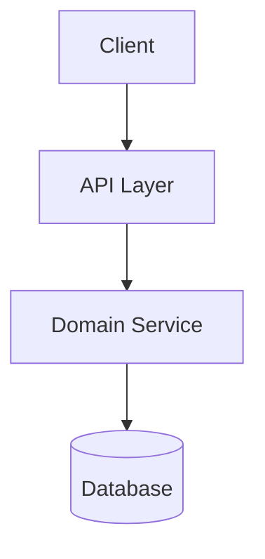
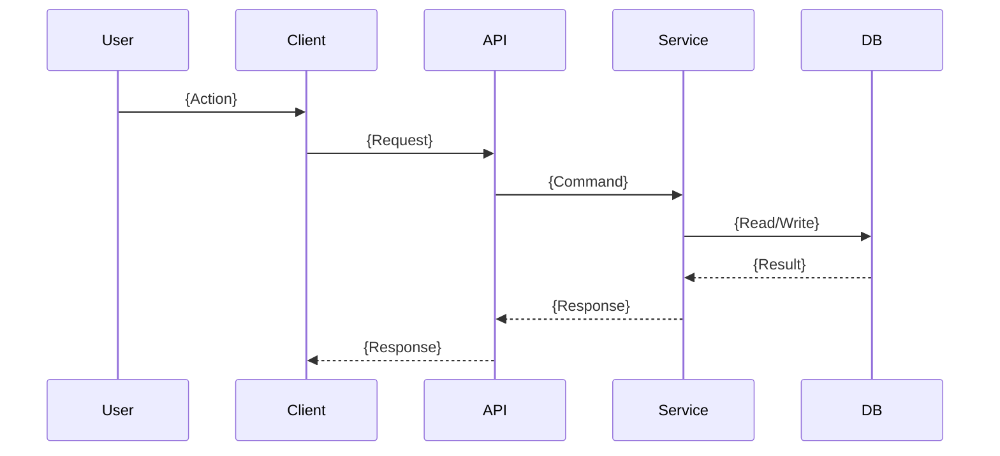

# {Feature Name} Design

## Overview

{High-level architecture intent and how this feature fits the system.}

## Requirement Coverage (RQ -> DSN)

Map each requirement to one or more design elements.

| Requirement ID | Covered By Design IDs | Notes |
|----------------|-----------------------|-------|
| RQ-001 | DSN-001, DSN-003 | {optional} |
| RQ-002 | DSN-002 | {optional} |

---

## Design Index

| Design ID | Element | Type | Notes |
|-----------|---------|------|-------|
| DSN-001 | {Auth flow} | component | {optional} |
| DSN-002 | {API contract} | interface | {optional} |
| DSN-003 | {Data model update} | data | {optional} |

---

## System Architecture

### Context
{Key boundaries, actors, and dependencies.}

### Diagram

---

## DSN-001: {Design Element Title}

**Type:** component | interface | data | workflow

**Purpose:**
{Why this element exists and which requirement it satisfies.}

**Covers Requirements:**
- RQ-001

**Responsibilities:**
- {Responsibility 1}
- {Responsibility 2}

**Interfaces / Contracts:**
- Input: {format/type}
- Output: {format/type}

**Risks and Mitigations:**
- Risk: {risk}
- Mitigation: {mitigation}

---

## DSN-002: {Design Element Title}

**Type:** component | interface | data | workflow

**Purpose:**
{Why this element exists and which requirement it satisfies.}

**Covers Requirements:**
- RQ-002

**Key Decisions:**
- Decision: {decision}
- Trade-off: {trade-off}

---

## Data Model

### {Entity Name}

| Field | Type | Required | Constraints | Description |
|-------|------|----------|-------------|-------------|
| {field} | {type} | yes/no | {rule} | {desc} |

---

## API / Interface Design

### {Endpoint or Interface Name}

- Method: {GET/POST/...}
- Path: `{path}`
- Auth: {required/optional}
- Request schema: {summary}
- Response schema: {summary}
- Error model: {summary}

---

## Sequence Flows

### Flow 1: {Flow Name}

---

## Non-Functional Strategy

### Security
- {authz/authn/validation/logging controls}

### Performance
- {latency/throughput/caching/index strategy}

### Reliability
- {retry/timeout/idempotency/fallback behavior}

---

## Operational Considerations

### Migration / Backward Compatibility
- {plan}

### Rollout / Rollback
- {plan}

### Observability
- Metrics: {key metrics}
- Logs/alerts: {key signals}

---

## Open Decisions

| ID | Decision | Options | Owner | Deadline |
|----|----------|---------|-------|----------|
| D-001 | {topic} | {A/B/C} | {name/role} | {date} |
